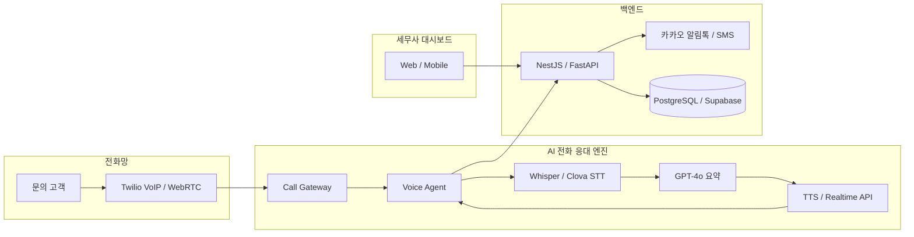
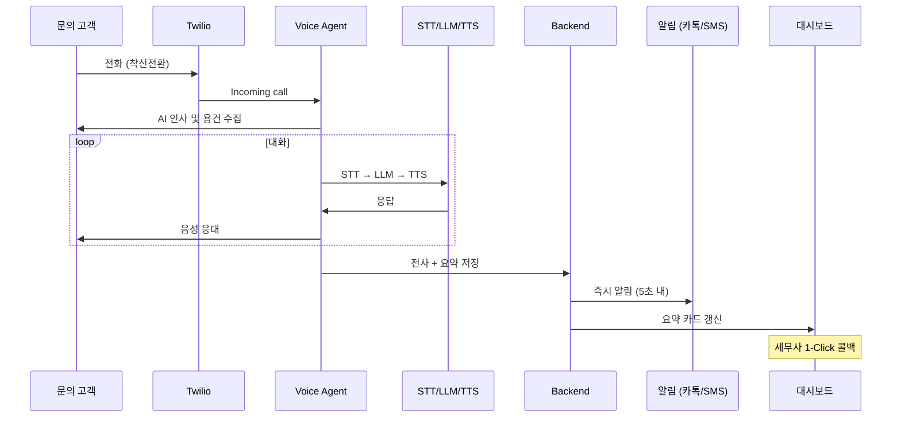

# ARCHITECTURE — AI 전문직 전화 비서

> 시스템/전화망 연동 아키텍처 (기술용)

## 1. 개요

서비스는 **실시간 AI 응대 엔진(전화망)**과 **세무사 전용 대시보드(웹/앱)** 두 축으로 구성된다.

```
[고객 전화] ──(부재/통화중 착신전환)──> [AI 전화 비서 (VoIP/STT/LLM)]
                                              │
                                    (용건 요약 & 카테고리화)
                                              │
                                              ▼
[세무사 콜백 & 업무 완료] <──(카톡/웹 알림)─── [세무사 전용 대시보드]
```

## 2. 고수준 아키텍처



## 3. 주요 컴포넌트

### 3.1 Call Gateway (Twilio)
- 부재/통화중 착신전환으로 수신되는 VoIP 전용 번호 처리
- Incoming webhook, 미디어 스트림(WebSocket) 연동
- 통화 종료 이벤트 → 요약 파이프라인 트리거

### 3.2 Voice Agent
- 자연스러운 TTS 기반 인사 및 용건 수집 대화
- OpenAI Realtime API 또는 Whisper STT + GPT-4o + TTS 조합
- 세무사 사무실 맞춤 응대 스크립트 실행

### 3.3 AI 용건 요약 파이프라인
| 단계 | 역할 | 기술 |
|------|------|------|
| STT | 음성 → 텍스트 | Whisper, Clova Speech (세무 전문 용어 딕셔너리) |
| LLM | 핵심 정보 추출·구조화 | GPT-4o, 세무 전문 프롬프트 |
| Output | 요약 카드 생성 | `고객명`, `연락처`, `세목 카테고리`, `3줄 요약`, `긴급도` |

### 3.4 세무사 대시보드 API & Web
- 실시간 리드 카탈로그 (용건 요약 카드)
- 1-Click 콜백 (고객 즉시 연결)
- 상담 상태 관리: `대기 중` → `콜백 완료` → `상담 완료`

### 3.5 알림 서비스
- 전화 종료 후 5초 내 카카오 알림톡 / SMS / Push 전달
- 웹 대시보드 실시간 업데이트

## 4. 통화 처리 시퀀스



## 5. 기술 스택

| 영역 | 기술 |
|------|------|
| Telephony / Voice | Twilio (VoIP), OpenAI Realtime API / Clova Speech |
| Backend | Node.js (NestJS) 또는 Python (FastAPI) |
| Frontend | React / Next.js, Tailwind CSS |
| Database | PostgreSQL / Supabase |
| Infrastructure | AWS / Vercel |

## 6. MVP vs v2.0

### MVP
- Twilio VoIP 착신전환 연동
- AI 음성 응대 + 세무 용어 요약 파이프라인
- 세무사 웹 대시보드
- 카카오 알림톡 / SMS

### v2.0 (미룸)
- 세무사 개인 음성 클로닝
- 홈텍스 / 더존 등 세무 프로그램 연동
- 챗봇 기반 사전 서류 접수

## 7. 관련 문서

- [PRD_v1.0.md](./PRD_v1.0.md)
- [USER_FLOW.md](./USER_FLOW.md)

**버전:** 1.0  
**최종 수정:** 2026-07-21
