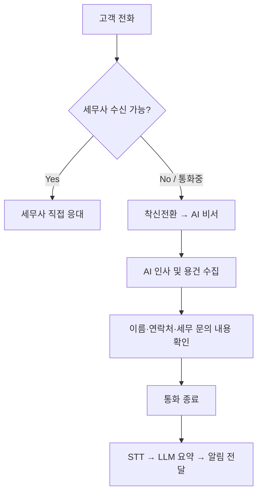
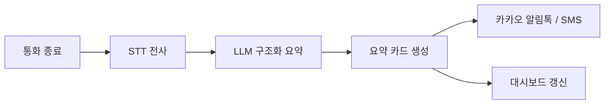
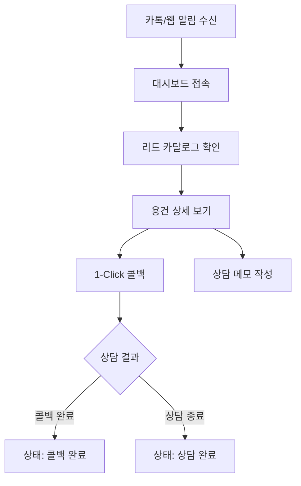

# USER_FLOW — AI 전문직 전화 비서

> 통화 응대 및 대시보드 유저 플로우

## 1. 액터

| 액터 | 설명 |
|------|------|
| **문의 고객 (End User)** | 세무사 사무실로 전화를 거는 고객 |
| **AI 전화 비서 (Voice Agent)** | 부재/통화중 시 용건을 수집하는 AI |
| **세무사 (Primary User)** | 대시보드에서 요약을 확인하고 콜백하는 전문가 |

---

## 2. 통화 응대 플로우 (고객 관점)

### 2.1 AI 응대 스크립트 흐름

1. **인사** — "안녕하세요, OO 세무사 사무실 AI 비서입니다."
2. **상황 안내** — "세무사님이 현재 상담 중이셔서 메시지를 남겨주시면 바로 전달해 드리겠습니다."
3. **용건 수집** — "어떤 세무 관련 건으로 전화주셨나요?"
4. **정보 확인** — 고객명, 연락처, 세목(양도세/증여세/부가가치세 등), 긴급도
5. **종료** — "전달해 드리겠습니다. 감사합니다."

---

## 3. AI 용건 요약 → 알림 플로우

**Extracted Data 예시:**
- `고객명`, `연락처`
- `세목 카테고리` (양도세 / 증여세 / 부가가치세 등)
- `주요 문의 요약` (3줄)
- `긴급도` (상 / 중 / 하)

---

## 4. 세무사 대시보드 플로우

### 4.1 상담 상태

| 상태 | 설명 |
|------|------|
| `대기 중` | AI가 용건 수집 완료, 세무사 콜백 전 |
| `콜백 완료` | 세무사가 고객에게 연락 완료 |
| `상담 완료` | 상담 및 후속 업무 종료 |

### 4.2 세무사 시나리오 예시

1. 상담 중 부재중 전화 발생 → AI가 용건 수집
2. 카카오 알림톡으로 "양도세 문의 / 긴급도: 상" 수신
3. 대시보드에서 3줄 요약 확인 → 사전 조사 후 1-Click 콜백
4. 정답을 들고 고객에게 연락 → 상태 `상담 완료`로 변경

---

## 5. 기존 vs 개선 콜백 프로세스

| 단계 | 기존 (5단계) | 본 서비스 |
|------|-------------|-----------|
| 1 | 부재중 확인 | AI가 즉시 응대 |
| 2 | 고객에게 재전화 | (불필요 — AI가 용건 수집) |
| 3 | 용건 청취 | AI 요약 카드로 사전 확인 |
| 4 | "확인 후 연락" 안내 | 세무사가 사전 조사 후 콜백 |
| 5 | 재연락 | 1-Click 콜백으로 즉시 연결 |

---

## 6. 예외 케이스

| 상황 | 처리 |
|------|------|
| STT 인식 실패 (세무 전문 용어) | "다시 말씀해 주세요" + 딕셔너리 재시도 |
| 고객 통화 중 이탈 | 부분 전사 저장, 세무사에게 incomplete 표시 |
| LLM 요약 실패 | 원문 전사만 제공, 수동 확인 유도 |
| 긴급도 `상` | 알림톡 + Push 우선 전달 |

---

## 7. 관련 문서

- [PRD_v1.0.md](./PRD_v1.0.md)
- [ARCHITECTURE.md](./ARCHITECTURE.md)

**버전:** 1.0  
**최종 수정:** 2026-07-21
